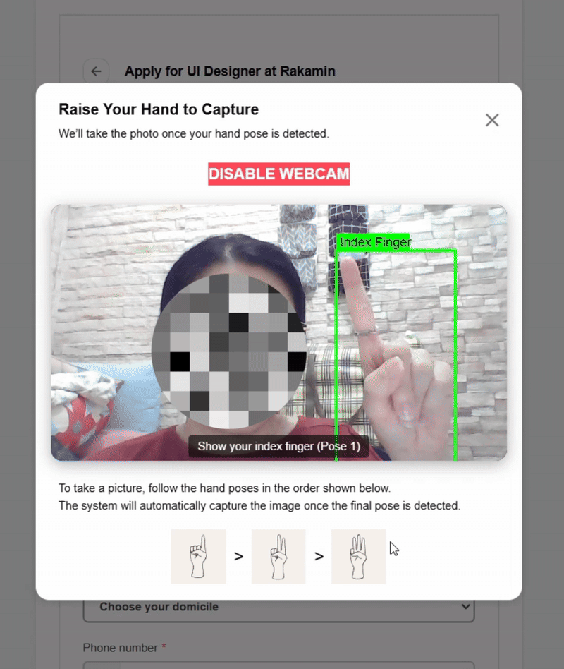

# 🧩 Frontend Engineer Case Study 2025
A simplified **Hiring Management Web App** that allows recruiters (Admin) to manage job vacancies and applicants (Job Seekers) to apply, built based on the given PRD and design handoff.

---

## 🚀 Project Overview
This project implements a **two-role hiring management system**:

### 👩‍💼 Admin (Recruiter)
- View all created job vacancies.  
- Create and configure job postings dynamically.  
- Manage and review candidate applications via a reorderable table view.

### 👨‍💻 Applicant (Job Seeker)
- View and apply for active job postings.  
- Application form fields adapt dynamically based on backend configuration.  
- Capture profile picture via webcam and hand gestures (1️⃣ 2️⃣ 3️⃣).

<p align="left">
  
</p>


The main focus of this project is:
- Translating **Figma design** and **PRD requirements** into a functional, responsive web app.  
- Demonstrating **dynamic frontend behavior** and **clean, modular code architecture**.  
- Providing a **pixel-perfect**, **accessible**, and **enterprise-grade** user experience.

---
## 🌐 Deployed App
Live Demo: [https://hiring-webapp-pi.vercel.app/]( https://hiring-webapp-pi.vercel.app/)

---

## 🔐 Authentication and Authorization

The application uses **Firebase Authentication** and includes three authentication methods:

1. **Email Link Sign-In** – Users receive a secure sign-in link via email.  
   *(Note: Check the spam folder as the link may sometimes be filtered there.)*

2. **Google Sign-In** – Simplified one-click login using a Google account.

3. **Email and Password** – Users can register directly using an email and password combination.

- All new users are automatically registered under the **Applicant (User)** role.
- To assign the **Admin** role, update the user’s role field manually in **Firebase Firestore**.
- This allows flexible role-based testing and ensures secure role management.

### 🧪 Demo Credentials (for evaluation)

**User Account**  
- Email: `user@rakatest.com`  
- Password: `rakatest`

**Admin Account**  
- Email: `admin@rakatest.com`  
- Password: `rakatest`

<h2 align="center">🎥 Demo Video [Admin]</h2>
<p align="center">
  <a href="https://youtu.be/llAJPq5vP10" target="_blank">
    
  </a>
</p>

<h2 align="center">🎥 Demo Video [User]</h2>
<p align="center">
  <a href="https://youtu.be/1M9PurztVkk" target="_blank">
    
  </a>
</p>

---

## 🧠 Tech Stack Used

| Area | Technology / Library | Notes |
|------|-----------------------|-------|
| **Framework** | [Next.js 14 (App Router)](https://nextjs.org/) | For building a performant React-based web app with routing and API integration |
| **Styling** | [Tailwind CSS](https://tailwindcss.com/) | For utility-first responsive design and consistent styling |
| **Database / Backend** | [Supabase](https://supabase.com/) | Used for job listings and candidate data persistence |
| **Authentication** | [Firebase Auth](https://firebase.google.com/docs/auth) | To manage user roles (Admin / Applicant) |
| **Firestore** | [Firebase Firestore](https://firebase.google.com/docs/firestore) | Used to store user metadata such as role and profile info |
| **State Management** | React built-in hooks (`useState`, `useEffect`, `useContext`) | Simple local state handling — **no Redux/Zustand needed** for this project’s scope |
| **Webcam & Gesture** | @mediapipe/tasks-vision + Browser Webcam API | Detects hand gestures for profile photo capture (user permission required, privacy-friendly) |
| **Deployment** | [Vercel](https://vercel.com/) | For hosting and CI/CD integration with Next.js |

### ⚡ Why no Redux / Zustand?
This project’s state management is **component-scoped** and **contextual** — React’s native hooks and context API are sufficient for handling user role, form state, and simple data flow.  
Introducing a global state library like Redux or Zustand would add unnecessary complexity for this scale.

---


---

## 🧭 How to Run Locally

### 1️⃣ Clone this repository
```bash
git clone https://github.com/yourusername/rakamin-frontend-case.git
cd rakamin-frontend-case
```

### 2️⃣ Install dependencies
```bash
npm install
# or
yarn install
```

3️⃣ Setup environment variables
Create a .env.local file in the root directory with the following:
```bash
NEXT_PUBLIC_FIREBASE_API_KEY=your_firebase_key
NEXT_PUBLIC_FIREBASE_AUTH_DOMAIN=your_project.firebaseapp.com
NEXT_PUBLIC_FIREBASE_PROJECT_ID=your_project_id
NEXT_PUBLIC_FIREBASE_STORAGE_BUCKET=your_project.appspot.com
NEXT_PUBLIC_FIREBASE_MESSAGING_SENDER_ID=your_sender_id
NEXT_PUBLIC_FIREBASE_APP_ID=your_app_id

NEXT_PUBLIC_SUPABASE_URL=your_supabase_url
NEXT_PUBLIC_SUPABASE_ANON_KEY=your_supabase_anon_key
```

4️⃣ Run the development server
```bash
npm run dev
# or
yarn dev
```

App will be available at http://localhost:3000

## 🚀 Deployment (Vercel)

This project is deployed using Vercel.

🧩 Build Environment Variables

Vercel allows you to inject environment variables directly into your build step using the --build-env flag.

You can set environment variables like API keys or service URLs when deploying manually from the terminal:

```bash
vercel --build-env NEXT_PUBLIC_SUPABASE_URL=https://your-supabase-url.supabase.co \
--build-env NEXT_PUBLIC_SUPABASE_ANON_KEY=your-supabase-anon-key \
--build-env NEXT_PUBLIC_FIREBASE_API_KEY=your-firebase-api-key \
--build-env NEXT_PUBLIC_FIREBASE_AUTH_DOMAIN=your-firebase-auth-domain \
--build-env NEXT_PUBLIC_FIREBASE_PROJECT_ID=your-firebase-project-id \
--build-env NEXT_PUBLIC_FIREBASE_STORAGE_BUCKET=your-firebase-storage-bucket \
--build-env NEXT_PUBLIC_FIREBASE_MESSAGING_SENDER_ID=your-firebase-sender-id \
--build-env NEXT_PUBLIC_FIREBASE_APP_ID=your-firebase-app-id
```


Alternatively, you can set these variables permanently in your Vercel project dashboard under
Settings → Environment Variables (recommended).

🌐 Production Deployment

To deploy the project to your production domain (as configured in Vercel):

```
vercel --prod
```

Or combine both steps (set build-time environment variables + deploy to production):

```
vercel \
--build-env NEXT_PUBLIC_SUPABASE_URL=https://your-supabase-url.supabase.co \
--build-env NEXT_PUBLIC_SUPABASE_ANON_KEY=your-anon-key \
--build-env NEXT_PUBLIC_FIREBASE_API_KEY=your-firebase-api-key \
--build-env NEXT_PUBLIC_FIREBASE_AUTH_DOMAIN=your-firebase-auth-domain \
--build-env NEXT_PUBLIC_FIREBASE_PROJECT_ID=your-firebase-project-id \
--build-env NEXT_PUBLIC_FIREBASE_STORAGE_BUCKET=your-firebase-bucket \
--build-env NEXT_PUBLIC_FIREBASE_MESSAGING_SENDER_ID=your-sender-id \
--build-env NEXT_PUBLIC_FIREBASE_APP_ID=your-app-id \
--prod
```

✅ Tip:
If you already configured your environment variables in Vercel, you only need to run:

```
vercel --prod
```

⚙️ Email Link Authentication Setup

The project supports Email Link Sign-In via Firebase Authentication.
To ensure proper redirection after login, update the redirect URL in the file:

features/auth/lib/emailLinkAuth.ts

```
const actionCodeSettings = {
  url: process.env.NEXT_PUBLIC_EMAIL_LINK_REDIRECT_URL || "http://localhost:3000/",
  handleCodeInApp: true,
};
```


## 🗄️ Database Structure
Table: resume_submission

| Column           | Type          | Default / Notes                                             | Primary |
| ---------------- | ------------- | ----------------------------------------------------------- | ------- |
| **id**           | `int8`        | —                                                           | ✅       |
| **created_at**   | `timestamptz` | `now()`                                                     | —       |
| **job_id**       | `int8`        | —                                                           | —       |
| **fullName**     | `text`        | —                                                           | —       |
| **dateOfBirth**  | `text`        | —                                                           | —       |
| **gender**       | `text`        | —                                                           | —       |
| **domicile**     | `text`        | —                                                           | —       |
| **phoneNumber**  | `text**       | —                                                           | —       |
| **email**        | `text`        | —                                                           | —       |
| **linkedinLink** | `text`        | —                                                           | —       |
| **photoProfile** | `text`        | Stores the path/URL of the user’s photo in Supabase Storage | —       |
| **uid**          | `text`        | Firebase Auth UID for unique applicant mapping              | —       |

Notes:
- photoProfile securely stores the profile photo path in Supabase Storage.
- uid connects the applicant to their Firebase Auth record.

Table: job

| Column             | Type          | Default / Notes                   | Primary |
| ------------------ | ------------- | --------------------------------- | ------- |
| **id**             | `int8`        | —                                 | ✅       |
| **startDate**      | `timestamptz` | `now()`                           | —       |
| **title**          | `text`        | —                                 | —       |
| **candidateCount** | `numeric`     | `'0'::numeric`                    | —       |
| **minSalary**      | `numeric`     | —                                 | —       |
| **maxSalary**      | `numeric`     | —                                 | —       |
| **status**         | `text`        | —                                 | —       |
| **company**        | `text`        | `'Rakamin'` (default)             | —       |
| **location**       | `text`        | `'Jakarta, Indonesia'` (default)  | —       |
| **description**    | `text`        | —                                 | —       |
| **type**           | `text`        | —                                 | —       |
| **formFields**     | `jsonb`       | `{}` — dynamic form configuration | —       |

Notes:
- formFields defines each job’s application form fields and their states (mandatory, optional, or off).
- The Admin panel dynamically reads this configuration to render form fields for applicants.


## 🧱 Future Improvements
🧑‍💼 Applicant Dashboard

- View application history and track job status (e.g., Under Review, Accepted, Rejected).
- Allow users to upload and manage CVs or portfolios instead of filling only text-based forms.
- Display personalized job recommendations based on past applications.

🧾 Admin Dashboard

- Centralized dashboard to review, filter, and manage applicants efficiently.
- Add application progress tracking (e.g., New → Reviewed → Interview → Hired).
- Include analytics insights: total applicants, conversion rate, and job posting performance.

🧪 Testing and QA

- Playwright coverage to include edge cases, error handling, and authentication flows.
- Integrate automated testing via CI/CD (Vercel or GitHub Actions).

♿ Accessibility Enhancements

- Improve keyboard navigation, focus rings, and ARIA roles for screen reader support.
- Add text alternatives for icons and dynamic UI elements.

🎨 User Experience (UX)

- Add a dark mode toggle for better usability and reduced eye strain.
- Enhance loading states and animations for smoother transitions.
- Add a multi-step progress indicator on the job application form.

⚙️ System Enhancements

- Implement server-side pagination and filtering for large datasets.
- Add email notifications for job creation, application submission, and status updates.
- Enable persistent table configuration (column order, width, filters) across sessions.
- Introduce role-based dashboards with conditional navigation and analytics.

🖐️ Webcam & Gesture Recognition (Planned Integration)

- Add face alignment and detection for better profile photo accuracy and consistency.

## ⚠️ Known Limitations
 - 🧱 **Backend Integration Simplified** — uses Supabase and Firebase in combination instead of a full backend API.  
 - 🔁 **Column reordering** implemented with basic logic; not persisted across sessions yet.  
 - 🧩 **Form validation** currently based on front-end schema from Supabase response (no deep nested field validation).  
 - 📱 Some spacing may slightly differ from Figma on smaller viewports due to Tailwind breakpoints.  
 - 🧾 No authentication persistence (session restore) beyond Firebase default — would need additional logic for production.

## 📝 License

This project is for Case Study — intended solely for assessment and demonstration purposes.
